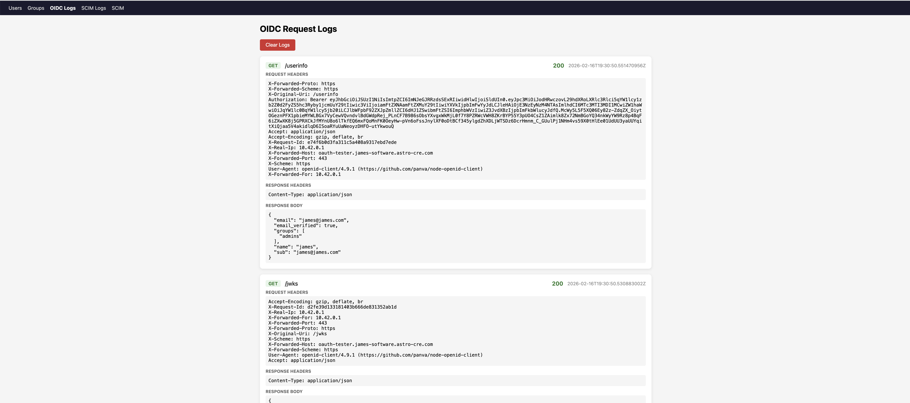
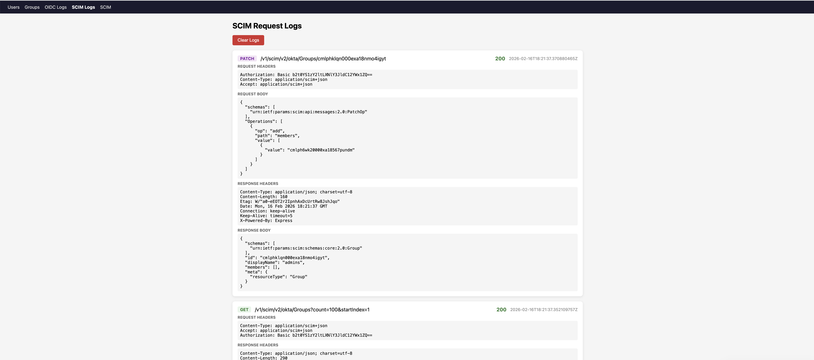

# oauth-tester

A minimal, transparent OpenID Connect provider and SCIM 2.0 client for testing Houston integration. Single binary, single SQLite file, zero external dependencies.

## Why this exists

When integrating with OIDC and SCIM, the interesting bits — authorization codes, token exchanges, JWT contents, SCIM payloads — live inside HTTPS requests that aren't easy to inspect. oauth-tester makes every HTTP request and response visible, both in a web UI and via a JSON API designed for consumption by LLMs. It's a purpose-built companion for testing Houston integration end to end.

## Machine-readable logs: built for AI-assisted debugging

Every OIDC and SCIM HTTP request/response pair is captured to SQLite and exposed through a structured JSON API. oauth-tester is designed so that an LLM can query what happened, read the full HTTP traces, and help you diagnose issues without you ever opening a network inspector.

### How it works

Point your AI coding assistant at the log API and ask questions in plain English:

```bash
# "Why did the token exchange fail?"
curl -sk 'https://localhost/api/logs?source=oidc&path=/token&method=POST&limit=3'

# "What did the last SCIM sync send to Houston?"
curl -sk 'https://localhost/api/logs?source=scim&limit=20'

# "Show me any 400s in the last 10 minutes"
curl -sk 'https://localhost/api/logs?status=400&minutes_ago=10'
```

The response is a JSON array of complete request/response pairs — method, path, headers, body, status code, and timestamp. JWTs in `/token` responses are automatically decoded into their header and claims so the model (or you) can read them directly:

```json
{
  "method": "POST",
  "path": "/token",
  "request_body": "grant_type=authorization_code&code=abc123...",
  "response_status": 200,
  "response_body": {
    "id_token": {
      "header": {"alg": "RS256", "kid": "..."},
      "claims": {"sub": "alice@example.com", "groups": ["engineers"]}
    }
  }
}
```

No more copying tokens into jwt.io. No more scrolling through browser devtools. Ask the question, get the answer.

### Log filters

| Parameter | Example | Description |
|---|---|---|
| `source` | `oidc`, `scim` | Log source |
| `method` | `POST` | HTTP method |
| `path` | `/token` | Request path |
| `status` | `400` | Response status code |
| `limit` | `10` | Max results (default 50) |
| `minutes_ago` | `30` | Time window |

### Web UI

The same logs are available in a browser — auto-refreshing every 3 seconds with color-coded status codes, pretty-printed JSON, and inline JWT decoding. A **Clear Logs** button resets between test runs.

**OIDC logs** (`/ui/logs/oidc`) — discovery, auth, token, and userinfo requests:



**SCIM logs** (`/ui/logs/scim`) — every API call made to Houston during a sync:



## Quick start

```bash
# Set required env vars
export ISSUER_URL=https://oauth-tester.example.com
export CLIENT_ID=my-client-id

# Optional
export CLIENT_SECRET=my-secret  # validated on /token if set
export TLS_CERT=cert.pem        # default: cert.pem
export TLS_KEY=key.pem          # default: key.pem
export DB_PATH=oauth-tester.db  # default: oauth-tester.db

go build -o oauth-tester .
./oauth-tester
```

The server listens on `:443` (TLS required). An RSA-2048 key pair is generated at startup for JWT signing.

### Docker

```dockerfile
# Multi-stage build, scratch base image
docker build -f Dockerfile.app -t oauth-tester .
```

The resulting image is a statically-compiled binary (`CGO_ENABLED=0`) on `scratch` — nothing else in the container.

## OIDC endpoints

| Endpoint | Method | Description |
|---|---|---|
| `/.well-known/openid-configuration` | GET | Discovery document |
| `/jwks` | GET | JSON Web Key Set (public RSA key) |
| `/auth` | GET | Login page (HTML form) |
| `/auth` | POST | Login submission, returns authorization code via redirect |
| `/token` | POST | Exchanges code for JWT (RS256, 1-hour expiry) |
| `/userinfo` | GET | Returns claims for a Bearer token |

Supports `client_secret_post` and `client_secret_basic` authentication. JWTs include `email`, `name`, and `groups` claims (defaults to `["users"]` if the user has no groups).

## User and group management

The web UI at `/ui/users` and `/ui/groups` provides CRUD for users and groups.


The same operations are available via JSON API:

```
GET/POST       /api/users
PUT/DELETE     /api/users/{username}

GET/POST       /api/groups
DELETE         /api/groups/{name}
GET/POST       /api/groups/{name}/members
DELETE         /api/groups/{name}/members/{username}
```

## SCIM integration with Houston

oauth-tester includes a SCIM 2.0 client that pushes users and groups to Houston's Okta SCIM endpoint (`/v1/scim/v2/okta`). This is the same endpoint that Okta uses for real SCIM provisioning — oauth-tester acts as a substitute for Okta in lab environments.

### Setup

1. Configure the Houston URL and SCIM auth code at `/ui/scim` (or `PUT /api/scim/config`)
2. Click **Push to Houston** (or `POST /api/scim/push`) to sync local state to Houston
3. The sync is idempotent: creates missing users/groups, updates display names, deactivates removed users, patches group membership


### Authentication

Houston's SCIM endpoint expects HTTP Basic auth with the SCIM auth code base64-encoded as the credentials:

```
Authorization: Basic base64(auth_code)
```

### SCIM operations

| Operation | HTTP | Path |
|---|---|---|
| List users | GET | `/v1/scim/v2/okta/Users` |
| Create user | POST | `/v1/scim/v2/okta/Users` |
| Update user | PUT | `/v1/scim/v2/okta/Users/{id}` |
| Delete user (soft) | DELETE | `/v1/scim/v2/okta/Users/{id}` |
| List groups | GET | `/v1/scim/v2/okta/Groups` |
| Create group | POST | `/v1/scim/v2/okta/Groups` |
| Delete group | DELETE | `/v1/scim/v2/okta/Groups/{id}` |
| Patch members | PATCH | `/v1/scim/v2/okta/Groups/{id}` |

The sync engine diffs local vs. remote state and issues the minimum set of API calls. User deletes are soft (deactivation). Group deletes are hard.

## Architecture

```
internal/
  config/     Environment variable parsing
  crypto/     RSA key generation and JWT signing (RS256)
  oidc/       OIDC endpoint handlers
  scim/       SCIM 2.0 client and sync engine
  server/     HTTP routing
  store/      SQLite data layer + logging middleware
  ui/         Web UI handlers and HTML templates
```

Single dependency: `modernc.org/sqlite` (pure Go, no CGO). The database uses WAL mode and foreign keys with cascade deletes. Schema migrations run on startup.

## Not for production

Passwords are stored in plaintext. There is no rate limiting, no PKCE enforcement, and no session management. This is a lab tool for understanding and debugging OIDC/SCIM flows, not an identity provider.
